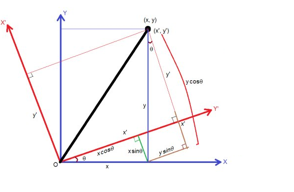
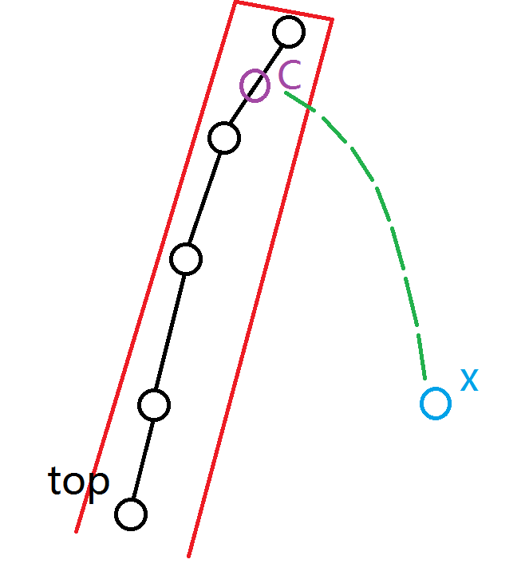

<h2>Table of Contents</h2>

<ul>
<li><a href="#sec-1">1. 基础算法</a>
<ul>
<li><a href="#sec-1-1">1.1. 位运算</a>
<ul>
<li><a href="#sec-1-1-1">1.1.1. 位运算的性质</a></li>
<li><a href="#sec-1-1-2">1.1.2. 输出整数的二进制表示</a></li>
<li><a href="#sec-1-1-3">1.1.3. 基本操作</a></li>
</ul>
</li>
</ul>
</li>
<li><a href="#sec-2">2. 动态规划</a>
<ul>
<li><a href="#sec-2-1">2.1. 概述</a>
<ul>
<li><a href="#sec-2-1-1">2.1.1. 动态规划的优化</a></li>
</ul>
</li>
<li><a href="#sec-2-2">2.2. 背包DP</a>
<ul>
<li><a href="#sec-2-2-1">2.2.1. 01背包</a></li>
<li><a href="#sec-2-2-2">2.2.2. 完全背包</a></li>
<li><a href="#sec-2-2-3">2.2.3. 多重背包</a></li>
<li><a href="#sec-2-2-4">2.2.4. 分组背包</a></li>
</ul>
</li>
<li><a href="#sec-2-3">2.3. 线性DP</a>
<ul>
<li><a href="#sec-2-3-1">2.3.1. LIS</a></li>
<li><a href="#sec-2-3-2">2.3.2. LCS</a></li>
<li><a href="#sec-2-3-3">2.3.3. 数字三角形</a></li>
</ul>
</li>
<li><a href="#sec-2-4">2.4. 期望DP</a></li>
<li><a href="#sec-2-5">2.5. 树形DP</a></li>
</ul>
</li>
<li><a href="#sec-3">3. 数学</a>
<ul>
<li><a href="#sec-3-1">3.1. 数论</a>
<ul>
<li><a href="#sec-3-1-1">3.1.1. 约数</a></li>
<li><a href="#sec-3-1-2">3.1.2. 剩余系</a></li>
<li><a href="#sec-3-1-3">3.1.3. Lucas定理</a></li>
<li><a href="#sec-3-1-4">3.1.4. 扩展欧几里得算法</a></li>
</ul>
</li>
<li><a href="#sec-3-2">3.2. 线性代数</a>
<ul>
<li><a href="#sec-3-2-1">3.2.1. 矩阵</a></li>
<li><a href="#sec-3-2-2">3.2.2. 线性基</a></li>
</ul>
</li>
<li><a href="#sec-3-3">3.3. 计算几何</a>
<ul>
<li><a href="#sec-3-3-1">3.3.1. 向量</a></li>
<li><a href="#sec-3-3-2">3.3.2. 曼哈顿距离</a></li>
</ul>
</li>
<li><a href="#sec-3-4">3.4. 组合数学</a>
<ul>
<li><a href="#sec-3-4-1">3.4.1. Dilworth定理</a></li>
</ul>
</li>
<li><a href="#sec-3-5">3.5. 高等数学</a>
<ul>
<li><a href="#sec-3-5-1">3.5.1. 函数</a></li>
</ul>
</li>
</ul>
</li>
<li><a href="#sec-4">4. 数据结构</a>
<ul>
<li><a href="#sec-4-1">4.1. 栈</a>
<ul>
<li><a href="#sec-4-1-1">4.1.1. 单调栈</a></li>
</ul>
</li>
<li><a href="#sec-4-2">4.2. 线段树</a>
<ul>
<li><a href="#sec-4-2-1">4.2.1. 线段树上的二分操作</a></li>
</ul>
</li>
<li><a href="#sec-4-3">4.3. ST表</a>
<ul>
<li><a href="#sec-4-3-1">4.3.1. ST表的使用条件</a></li>
<li><a href="#sec-4-3-2">4.3.2. 实现</a></li>
</ul>
</li>
<li><a href="#sec-4-4">4.4. Treap</a>
<ul>
<li><a href="#sec-4-4-1">4.4.1. Treap的时间复杂度</a></li>
<li><a href="#sec-4-4-2">4.4.2. 无旋Treap实现</a></li>
</ul>
</li>
<li><a href="#sec-4-5">4.5. 左偏树</a>
<ul>
<li><a href="#sec-4-5-1">4.5.1. 左偏树的时间复杂度</a></li>
<li><a href="#sec-4-5-2">4.5.2. 实现</a></li>
</ul>
</li>
<li><a href="#sec-4-6">4.6. Link-Cut-Tree</a>
<ul>
<li><a href="#sec-4-6-1">4.6.1. 定义</a></li>
<li><a href="#sec-4-6-2">4.6.2. 实现</a></li>
</ul>
</li>
</ul>
</li>
<li><a href="#sec-5">5. 字符串</a>
<ul>
<li><a href="#sec-5-1">5.1. KMP</a></li>
<li><a href="#sec-5-2">5.2. Manacher</a></li>
<li><a href="#sec-5-3">5.3. 后缀数组</a>
<ul>
<li><a href="#sec-5-3-1">5.3.1. 定义</a></li>
<li><a href="#sec-5-3-2">5.3.2. 构造</a></li>
<li><a href="#sec-5-3-3">5.3.3. 应用</a></li>
<li><a href="#sec-5-3-4">5.3.4. 资料</a></li>
</ul>
</li>
</ul>
</li>
<li><a href="#sec-6">6. 图论</a>
<ul>
<li><a href="#sec-6-1">6.1. 概论</a>
<ul>
<li><a href="#sec-6-1-1">6.1.1. 隐式图</a></li>
</ul>
</li>
<li><a href="#sec-6-2">6.2. 2-SAT</a>
<ul>
<li><a href="#sec-6-2-1">6.2.1. 算法流程</a></li>
<li><a href="#sec-6-2-2">6.2.2. 建图</a></li>
</ul>
</li>
<li><a href="#sec-6-3">6.3. 二分图</a>
<ul>
<li><a href="#sec-6-3-1">6.3.1. 定义</a></li>
<li><a href="#sec-6-3-2">6.3.2. 判定</a></li>
<li><a href="#sec-6-3-3">6.3.3. 性质</a></li>
<li><a href="#sec-6-3-4">6.3.4. 常见模型</a></li>
</ul>
</li>
<li><a href="#sec-6-4">6.4. 图的遍历</a>
<ul>
<li><a href="#sec-6-4-1">6.4.1. 欧拉回路</a></li>
<li><a href="#sec-6-4-2">6.4.2. 拓扑排序</a></li>
</ul>
</li>
<li><a href="#sec-6-5">6.5. 树</a>
<ul>
<li><a href="#sec-6-5-1">6.5.1. 树分治</a></li>
<li><a href="#sec-6-5-2">6.5.2. 最近公共祖先</a></li>
<li><a href="#sec-6-5-3">6.5.3. Prufer 序列</a></li>
<li><a href="#sec-6-5-4">6.5.4. 虚树</a></li>
</ul>
</li>
<li><a href="#sec-6-6">6.6. 最短路</a>
<ul>
<li><a href="#sec-6-6-1">6.6.1. Dijkstra</a></li>
<li><a href="#sec-6-6-2">6.6.2. SPFA</a></li>
</ul>
</li>
</ul>
</li>
</ul>

# 基础算法

## 位运算

### 位运算的性质

$$
x+y=x \& y + x | y
$$ 

### 输出整数的二进制表示

    for (int i = 0; i < 32; ++i) {
      cerr << (a < 0);
      a <<= 1;
    }

### 基本操作

<table border="2" cellspacing="0" cellpadding="6" rules="groups" frame="hsides">

<colgroup>
<col  class="left" />

<col  class="left" />
</colgroup>
<thead>
<tr>
<th scope="col" class="left">操作</th>
<th scope="col" class="left">实现</th>
</tr>
</thead>

<tbody>
<tr>
<td class="left">去掉最后一位</td>
<td class="left">x >> 1</td>
</tr>

<tr>
<td class="left">在最后加一个0</td>
<td class="left">x << 1</td>
</tr>

<tr>
<td class="left">在最后加一个1</td>
<td class="left">(x << 1) or 1</td>
</tr>

<tr>
<td class="left">把最后一位变成1</td>
<td class="left">x or 1</td>
</tr>

<tr>
<td class="left">把最后一位变成0</td>
<td class="left">(x or 1) - 1</td>
</tr>

<tr>
<td class="left">在最后一位取反</td>
<td class="left">x xor 1</td>
</tr>

<tr>
<td class="left">右数第k位取反</td>
<td class="left">x xor (1 << k)</td>
</tr>

<tr>
<td class="left">取末k位</td>
<td class="left">x and ((1 << k + 1) - 1)</td>
</tr>

<tr>
<td class="left">末k位取反</td>
<td class="left">x xor ((1 << k + 1) - 1)</td>
</tr>

<tr>
<td class="left">把右边连续的1变成0</td>
<td class="left">x and (x + 1)</td>
</tr>

<tr>
<td class="left">把右起第一个0变成1</td>
<td class="left">x or (x + 1)</td>
</tr>

<tr>
<td class="left">把右边连续的0变成1</td>
<td class="left">x or (x - 1)</td>
</tr>

<tr>
<td class="left">取右边连续的1</td>
<td class="left">(x xor (x + 1)) >> 1</td>
</tr>

<tr>
<td class="left">去掉右起第一个1的左边(lowbit)</td>
<td class="left">x & -x</td>
</tr>
</tbody>
</table>

# 动态规划

## 概述

动态规划是对状态空间进行分阶段、有顺序、无重复、决策性的遍历求解。

类比有向无环图的拓扑遍历。

三要素：阶段、状态、决策。

三前提：子问题重叠性、无后效性、最优子结构性质。

### 动态规划的优化

当状态定义的过于严格时会造成转移的困难。这时候就需要在保证符合题意的情况下放宽一些限制，注意题目中的“或”，“至少”等关键词，往往可以从这些地方入手。或者观察状态转移方程，看看状态有没有什么可以化简的地方。如果数据范围很小，可以想想状态压缩。

1.  状态压缩

    当数据范围很小的时候可以想到的优化方法，可用位运算加速。
    状态压缩后其实能从状态中得到很多信息，千万不要忽视这些信息。
    
    1.  枚举子集
    
        设当前集合为 \(S\) ，\(S\) 的所有子集 \(T\) 可以用 \(T=(T-1) and S\) 得到，\(T\) 的初值为 \(S\) 。这样枚举 \(S\) 集合，\(S\) 集合的二进制表示的顺序为从大到小。如果想要保证按照二进制表示的大小从小到大枚举，可以令 \(K=TxorS\) ，这样在，枚举 \(T\) 的过程中 \(K\) 的大小是递增的。 
    
    2.  图形填充方案计数
    
        有些题目会给一张网格图和一些特殊的图形，求用这些图形填充这张网格图的方案数，特殊的地方在于，网格图的行数或者列数一般会很小。我们可以考虑对小的那一维状态压缩，一般的状态形如: \(f[i][s]\) 表示第 \(i\) 行状态为 \(s\) 的方案数，可以视图形的特殊性考虑要不要附加上一行的状态。

## 背包DP

### 01背包

有 \(N\) 件物品和一个容量为 \(V\) 的背包。第 \(i\) 件物品的体积是 \(c[i]\) ，价值是 \(w[i]\) 。求解将哪些物品装入背包可使价值总和最大。

每种物品仅有一件，可以选择放或不放。

用子问题定义状态：即 \(f[i][v]\) 表示前 \(i\) 件物品恰放入一个容量为 \(v\) 的背包可以获得的最大价值。则其状态转移方程便是：

$$
f[i][v]=max\{f[i-1][v],f[i-1][v-c[i]]+w[i]\}
$$

可以使用滚动数组优化，优化之后的时间复杂度为 \(O(VN)\) ，空间复杂度为 \(O(V)\) 。

    for (int i = 0; i < n; ++i) {
      for (int j = v; j > c[i]; --j) {
        f[j] = max(f[j], f[j - c[i]] + w[i]);
      }
    }

### 完全背包

有 \(N\) 件物品和一个容量为 \(V\) 的背包。第 \(i\) 件物品的体积是 \(c[i]\) ，价值是 \(w[i]\) 。每种物品无穷多件，求解将哪些物品放入背包可以使价值总和最大。

枚举选了 \(k\) 件物品 \(i\) 放入背包，类似01背包的状态定义，得到方程：

$$
f[i][v]=max\{f[i-1][v-k*c[i]]+k*w[i]|0 \leq k*c[i] \leq v\}
$$

时间复杂度为 \(O(V*\sum_i V/c_i)\) 。

类似的使用滚动数组优化得到更简单的 \(O(VN)\) 的状态转移方程。

    for (int i = 0; i < n; ++i) {
      for (int j = c[i]; j <= v; ++j) {
        f[j] = max(f[j], f[j - c[i]] + w[i]);
      }
    }

### 多重背包

有 \(N\) 种物品和一个容量为 \(V\) 的背包。第 \(i\) 种物品最多有 \(n[i]\) 件可用，每件体积是 \(c[i]\) ，价值是 \(w[i]\) 。求解将哪些物品装入背包可使这些物品的费用总和不超过背包容量，且价值总和最大。

基础的状态转移方程与完全背包类似:

$$
f[i][v]=max\{f[i-1][v-k*c[i]]+k*w[i]|0 \leq k \leq n[i]\}
$$

复杂度为  \(O(V  \sum n[i])\) 。

1.  优化

    主要有两种优化：二进制拆分和单调队列。
    
    1.  二进制拆分
    
        把 \(n[i]\) 件物品i拆分成若干件物品，其体积和价值为原物品体积价值乘一个系数，然后用01背包算法解决。为了使我们解决的问题有意义，假设我们最优的选择方案选了 \(k\) 件物品 \(i\) ，考虑 \(k\) 的二进制拆分， \(k\) 一定能由几个 \(2^m\) 的子物品拼成。一般的，任何一个10进制数都有其唯一存在的二进制表示，那么系数一般取 \(1,2,4,8,16,...,2^{k-1},n[i]-2^{k}+1\) 。其中 \(k\) 是满足 \(n[i]-2^k+1>0\) 的最大整数。  
        如果这样处理，那么一件物品就被拆成 \(log(n[i])\) 件物品。对这些物品进行01背包即可。
    
    2.  单调队列
    
        观察状态转移方程，难以发现一些优美的性质，考虑变形:  
        设 \(p=v/c_{i},r=v \mod c_i\) ，那么：
        
        $$
        f[i][p*c_i+r]=max\{f[i-1][(p-k)*c_i+r]+k*w[i]\}
        $$
        
        设 \(m=p-k\) ，那么 \(k=p-m\) ：
        
        $$
        f[i][p*c_i+r]=max\{f[i-1][m*c_i+r]-m*w[i]+p*w[i]\}
        $$
        
        也就是
        
        $$
        f[i][p*c_i+r]=max\{f[i-1][m*c_i+r]-m*w[i]\}+p*w[i]
        $$
        
        现在这个式子就很有特点了，对于相同的 \(r\) ， \(DP\) 数组的第二维关于 \(m\) 相邻。  
        那么，我们先枚举 \(r\) ，然后枚举 \(j\) ，用单调队列优化转移，先保证队头满足 \(k=j-que[head].first \leq n[i]\) ，取队头更新： \(f[i][j*c_i+r]=que[head].second+j*w[i]\) ，从队尾插入 \(pair\{j,f[i-1][j*c_i+r]-j*w[i]\}\) 。总的时间复杂度 \(O(V N)\) 
        
            memset(f, 0x3f, sizeof(f));
            f[0] = 0;
            for (int i = 0; i < n; ++i) {
              for (int r = 0; r < v[i]; ++r) {
                que.clear();
                for (int j = 0; j < k / v[i] + 1; ++j) {
                  int s = j * v[i] + r;
                  if (s > k) {
                    break;
                  }
                  while (!que.empty() && j - que.front().first > c[i]) {
                    que.pop_front();
                  }
                  int lst = f[s];
                  if (!que.empty()) {
                    f[s] = min(f[s], que.front().second + j);
                  }
                  while (!que.empty() && que.back().second >= lst - j) {
                    que.pop_back();
                  }
                  que.push_back(mp(j, lst - j));
                }
              }
            }

### 分组背包

给出 \(N\) 组物品，其中第 \(i\) 组有 \(c[i]\) 个物品，第 \(i\) 组的第 \(j\) 个物品的体积为 \(v[i][j]\) ，价值为 \(w[i][j]\) ，有一个体积为 \(V\) 的背包，要求选择若干个物品放入背包使得在每组至多选择一个物品并且物品总体积不超过 \(V\) 的前提下有最大价值。

定义状态 \(f[i][j]\) 表示在前 \(i\) 组中选择容量为 \(j\) 的物品的最大价值。状态转移方程：

$$
f[i][j]=max\{f[i-1][j],f[i-1][j-v[i][k]]+w[i][k]\}
$$

同理可以通过改变枚举策略压缩空间复杂度。

    for (int i = 0; i < n; ++i) {
      for (int j = m; j >= 0; --j) {
        for (int k = 0; k < c[i]; ++k) {
          if (j - v[i][k] < 0) {
            continue;
          }
          f[j] = max(f[j], f[j - v[i][k]] + w[i][k]);
        }
      }
    }

## 线性DP

### LIS

给定一个长度为 \(N\) 的数列 \(A\) ，求数值单调递增的子序列长度最长是多少。 \(A\) 的任意子序列 \(B\) 可以表示为 \(B=\{A_{k_1},A_{k_2},...,A_{k_p}\}\) ，其中 \(k_1 < k_2 < k_3 < \cdots < k_p\) 。

在实际题目中， \(LIS\) 的模型可能会隐藏的很深。需要通过一些式子的变形来推导出能通过 \(LIS\) 解决的模型。

定义： \(f[i]\) 表示以 \(A[i]\) 为结尾的最长上升子序列的长度，状态转移方程为:

$$
f[i]= \max_{0 \leq j < i,A[j] < A[i]} {f[j]+1}
$$

边界为 \(f[0]=0\) ,目标为 \(\max_{1 \leq i \leq N} {f[i]}\) 。

朴素实现的时间复杂度为 \(O(n^2)\) 。

1.  优化

    相比于上面显然的状态设计，有另外一种巧妙的求 \(LIS\) 的 \(O(nlogn)\) 的递推算法。
    令 \(mn[i]\) 表示长度为 \(i\) 的 \(LIS\) 的最后一位最小是多少。贪心的想，较小的最后一位相比于较大的更优。而且， \(mn\) 数组关于 \(i\) 单调递增。于是有一个确定性的算法流程：初始化 \(mn[i]=inf(1 \leq i \leq n),mn[0]=-inf\) 。对于第 \(i\) 个数，我们找到当前最大的合法的 \(len\) 满足 \(mn[len] \leq A[i]\) ，并令 \(mn[len+1]=min(mn[len+1],A[i])\) 。最后合法的 \(mn[i] \neq inf\) 里最大的 \(i\) 就是答案。寻找 \(len\) 的过程可以二分实现，总时间复杂度 \(O(nlogn)\) 。

2.  变形

    把一个序列 \(A\) 变成非严格单调递增的(即单调不下降的)，定义 \(L\) 为 \(A\) 的最长不下降子序列的长度，至少需要修改 \(|A|-|{L}|\) 个数。
    把一个序列 \(A\) 变成单调严格递增，构造序列 \(B=\{A[i]-i\}\) ，至少需要修改 \(|A|-|{LIS_B}|\) 个数。
    若非严格单调递增，那么对于一个不需要修改的 \(A\) 的子序列 \(C\) ， \(C\)  需要满足 \(C_{k_1} < C_{k_2} < C_{k_3} < \cdots < C_{k_p}\) 。需要这样的子序列最长，减去 \(|LIS|\) 即最小。如果是严格单调递增，对于任意两个不需要修改的数 $A[i],A[j] (i < j) $ ，需要满足 \(A[j]-A[i] \geq j-i\) 。变形得到 \(A[j]-j \geq A[i]-i\) 。转化为序列 \(B\) 后得到与变形1类似的问题。

### LCS

给定两个长度分别为 \(N\) 和 \(M\) 的字符串 \(A\) 和 \(B\) ，求既是 \(A\) 的子序列，又是 \(B\) 的子序列的字符串长度最长是多少。

令 \(f[i][j]\) 表示前缀子串 \(A[0 \sim i]\) , \(B[0 \sim j]\) 的LCS的长度。状态转移方程:

$$
f[i][j]=max\left\{\begin{aligned}
&f[i-1][j]\\
&f[i][j-1]\\
&f[i-1][j-1]+1 (A[i]=A[j])
\end{aligned}\right. 
$$

边界: \(f[i][0]=f[0][j]=0\) ，答案: \(f[N-1][M-1]\) 

### 数字三角形

给定一个共有 \(N\) 行的三角矩阵 \(A\) ，其中第 \(i\) 行有 \(j\) 列。从左上角出发，每次可以向下一步或者向右下方一步，并获得目标位置的价值，最终到达底部，求最大价值和。

令 \(f[i][j]\) 表示从左上角走到位置 \((i,j)\) 的最大价值，状态转移方程:

$$
f[i][j]=A[i][j]+max\left\{\begin{aligned}
&f[i-1][j]\\
&f[i-1][j-1] (j>1)
\end{aligned}\right.
$$

边界 \(f[0][0]=A[0][0]\) ,答案为 \(\max_{0 \leq i \leq N-1} f[N-1][i]\) 。

## 期望DP

期望和概率一般是互通的。

计算期望一般有两种方法：

-   根据期望的线性性质直接计算
-   计算每一个随机变量的概率然后根据期望公式计算

一般情况下，终态确定时倒推，初态确定时正推。

## 树形DP

1.  树形背包

    一般的状态转移方程形如：
    
    $$
    f[u][j] = max(f[u][j], f[v][k] + f[u][j - k])
    $$

2.  树上支配问题

    一般可以根据题意列出一个直观的状态转移方程。然后可以视转移难度调整状态的设计，合适的状态设计很重要。

# 数学

## 数论

### 约数

1.  性质

    $$
    lcm(a,b) = ab/gcd(a,b)
    $$
    
    如果任意整数 \(a,b\) 都不为 \(0\)  ，则 \(gcd(a,b)\) 是 \(a\) 与 \(b\) 的线性组合集 \(\{ax+by:x,y \in Z\}\) 中的最小正元素。

2.  欧几里得算法

    定理： \(gcd(a, b) = gcd(b, a \bmod b)\) 。
    
    证明：
    
    设 \(a = kb + r\)  ，也就等于 \(a = kb + a \bmod b\)  。
    
    令 \(d\) 为 \(a\) 和 \(b\) 的公约数，则 \(d|a,d|b\) 。 根据整除的组合性质可得 \(d|(a-kb)=a \bmod b\)  。
    这也就说明， \(d\) 为 \(a \bmod b\) 的约数，即两者的公约数是一样的，所以最大公约数相等。
    
        long long gcd(long long a, long long b) {
          return !b ? a : gcd(b, a % b);
        }

3.  预处理

    一个 \(O(n)\) 预处理， \(O(1)\) 查询的做法。
    
    预处理：
    
    1.  通过记忆化搜索的形式求出 \(gcd[x][y]\) 数组 \((x,y \leq\sqrt{n})\) 。
    
    2.  利用线性筛求出每个数 \(x\) 的最小质因子 \(mindiv[x]\) 。
    
    3.  把每个数 \(x\) 都拆成三个因数之积，并且保证如果 \(x\) 的最大质因子 \(> \sqrt{n}\) 就单独让它做一个质因子。
    
    这样保证了如果三个因子里面有大于 \(\sqrt{n}\) 的数那么这个因子一定是一个质数。
    
    查询：
    
    假设我们当前要查询 \(gcd(x,y)\) 。 依次枚举 \(x\) 的三个约数，设当前因子为 \(d\)  ：
    
    如果 \(d>\sqrt{n}\) ，那么 \(d\) 为一个质数，只要判断 \(y\) 是否能整除 \(d\) 。如果能， \(ans\) 累乘 \(d\) ，并把这个 \(d\) 从 \(y\) 里除掉。
    
    否则，由 \(gcd(a,b)=gcd(b,a \bmod b)\) ，那么可知这一部分的 \(gcd=(d,y \bmod d)\) 。因为 \(d<\sqrt{n}\) ，这一部分已经预处理得到。 \(ans\) 累乘 \(gcd\) ，并把这个 \(gcd\) 从 \(y\) 里除掉。
    
        int dfs(int x, int y) {
          if (gcd[x][y]) {
            return gcd[x][y];
          }
          return !y ? (gcd[x][y] = x) : (gcd[x][y] = dfs(y, x % y));
        }
        
        int f[MAX][3];
        
        bool not_prime[MAX];
        
        int p[79001];
        int tot;
        
        int mindiv[MAX];
        
        inline void init() {
          for (int i = 0; i < N; ++i) {
            for (int j = 0; j < N; ++j) {
              dfs(i, j);
            }
          }
          mindiv[1] = 1;
          for (int i = 2; i < MAX; ++i) {
            if (!not_prime[i]) {
              p[tot++] = i;
              mindiv[i] = i;
            }
            for (int j = 0; j < tot; ++j) {
              int k = p[j] * i;
              if (k >= MAX) {
                break;
              }
              not_prime[k] = 1;
              mindiv[k] = p[j];
              if (mindiv[i] == p[j]) {
                break;
              }
            }
          }
          f[1][0] = 1;
          f[1][1] = 1;
          f[1][2] = 1;
          int lim = 1000;
          for (int i = 2; i < MAX; ++i) {
            int mn = mindiv[i];
            memcpy(f[i], f[i / mn], sizeof(f[i]));
            if (f[i][0]*mn <= lim) {
              f[i][0] *= mn;
            } else if (f[i][1]*mn <= lim) {
              f[i][1] *= mn;
            } else {
              f[i][2] *= mn;
            }
          }
        }
        
        int lim = 1000;
        
        inline int query(int x, int y) {
          if (x == 0 || y == 0) {
            return x + y;
          }
          int ret = 1;
          for (int i = 0; i < 3; ++i) {
            int k = f[x][i];
            if (k == 1) {
              continue;
            }
            if (k > lim) {
              if (y % k == 0) {
                y /= k;
                ret *= k;
              }
            } else {
              int l = gcd[k][y % k];
              ret *= l;
              y /= l;
            }
          }
          return ret;
        }

### 剩余系

在有些时候选择合适的剩余系可以化简问题。

如：求 \(Ak_0+Bk_1+Ck_2\) 在 \([0,h]\) 区间内有多少种取值。 \(h \leq 1e18,A, B, C \leq 1e5\) 。

考虑把这个式子放到 \(\bmod A\) 意义下，得到 \(Bk_1+Ck_2 \equiv h \pmod A\) 。那么，如果我们知道了最小的 \(X_i\) 满足 \(Bk_1+Ck_2=X_i \equiv i \pmod A\) ，那么对于所有小于等于 \(h\) 的 \(X_i+Ak_0\) 一定都可以满足。那么答案就是 \(\sum_{i=0}^{A-1} \Big(\Big\lfloor \frac{h-X_i}{A} \Big \rfloor+1\Big)\) 。考虑建图，从 \(i\) 向 \((i+B) \bmod A,(i+C) \bmod A\) 连边 \((0\leq i < A)\) 。求最短路即可。

### Lucas定理

$$
{\binom {m}{n}}\equiv \prod _{i=0}^{k}{\binom {m_{i}}{n_{i}}}{\pmod {p}}
$$

其中

$$

\begin{aligned}
m&=\sum_{i=0}^k m_i \cdot p^i\\
n&=\sum_{i=0}^k n_i \cdot p^i\\
\end{aligned}

$$

也可以表示成：

$$
\binom{m}{n} \equiv \binom{m \bmod p}{n \bmod p} \cdot \binom{\lfloor\frac{m}{p} \rfloor}{\lfloor \frac{n}{p} \rfloor} \pmod p
$$

1.  证明

    基于生成函数的证明：
    
    如果 \(p\) 为质数， \(1\leq n \leq p-1\) ，那么
    
    $$
    \binom{p}{n} = \frac{p \cdot (p - 1) \cdots (p - n + 1)}{n \cdot (n - 1) \cdots 1}
    $$
    
    可得 \(p\)  是 \(\binom{p}{n}\) 的一个因子。从生成函数的角度来说，这意味着
    
    $$\begin{aligned}
    (1 + X)^p &= \sum_{i=0}^p \binom{p}{i}\cdot X^i\\
    &\equiv 1+X^p \pmod p
    \end{aligned}$$
    
    类似的，对于每个非负整数 \(i\) ，有
    
    $$
    (1+X)^{p^i} \equiv 1 + X^{p^i} \pmod p
    $$
    
    令非负整数 \(m=\sum_{i=0}^k m_i p^i\) ， 那么
    
    $$
    
    \begin{aligned}
    \sum_{n=0}^m \binom{m}{n}X^n &= (1 + X)^m \\
    &=\prod_ {i=0}^k \Big ((1+X)^{p^i} \Big) ^{m_i}\\
    &\equiv \prod_{i=0}^k(1+X^{p^i})^{m_i}\\
    &=\prod_{i=0}^k\bigg ( \sum_{n_i=0}^{m_i} \binom{m_i}{n_i}X^{n_i p^i} \bigg)\\
    &=\prod_{i=0}^k \bigg (\sum_{n_i=0}^{p-1} \binom{m_i}{n_i}X^{n_ip^i} \bigg)\\
    &=\sum_{n=0}^m \bigg(\prod_{i=0}^k \binom{m_i}{n_i} \bigg) X^n \pmod p
    \end{aligned}
    
    $$
    
    得证，最后一步化简可由上一步展开观察得到。其中， \(m_i\) ， \(n_i\) 分别是 \(m\) 和 \(n\) 在 \(p\) 进制下的第 \(i\) 位。

2.  结论

    组合数 \(\binom{m}{n}\) 能被质数 \(p\) 整除当且仅当存在至少一个 \(i\) 使得在 \(n\) 和 \(m\) 在 \(p\) 进制下有 \(n_i > m_i\) 成立。

### 扩展欧几里得算法

1.  证明

    假设我们已经得到了关于 \(x'b+y'(a \bmod b)=gcd(b,a \bmod b)=d\) 的一组解 \(x,y\) 。
    
    现在要得到 \(ax+by=gcd(a,b)=r\) 的一组解。
    
    那么：
    
    $$\begin{aligned}
    a x + b y &= b x' + y' (a \bmod b)\\
    &= bx' + y'(a - \lfloor \frac{a}{b} \rfloor * b) \\
    &= y'a + b(x' - \lfloor \frac{a}{b} \rfloor*y')
    \end{aligned}$$
    
    由此可得：
    
    $$\begin{aligned}
    x &= y'\\
    y &= x' - \lfloor \frac{a}{b} \rfloor * y'
    \end{aligned}$$
    
    由欧几里得算法可得一组初始解，回溯过程中回代即可。
    
    对于方程 \(ax+by=c\) 的所有解，如果 \(gcd(a,b) \nmid c\) 那么方程无解。否则先用扩展欧几里得算法求出方程的任意一组解满足 \(ax_0+by_0=gcd(a,b)=d\)  ，对于这个方程，所有解的解集为 
    \(\{(x',y'): x' = x_0 + k \frac{lcm(a,b)}{a}, y'=y_0-k*\frac{lcm(a,b)}{b}\}\) 。 对于原方程，只需要令 \(x=x'*\frac{c}{d},y=y'*\frac{c}{d}\) 。 
    
        void exgcd(long long a, long long b, long long &x, long long &y) {
          if (!b) {
            x = 1;
            y = 0;
            return;
          }
          exgcd(b, a % b, y, x);
          y -= (a / b) * x;
        }

2.  应用

    当 \(a, p\) 互质时，扩展欧几里得算法能用来求解 \(a\) 在 \(\bmod p\) 意义下的逆元。
    
    有： \(ax \equiv 1 \bmod p\)  ，也就是 \(ax + py = 1\)  。当 \(gcd(a,p)=1\) 的时候用扩展欧几里得求出一组解 \(x,y\)  。因为 \(a,p\) 互质所以 \(x+k* \frac{lcm(a,p)}{a} = x + k * p\) 都为方程的解。在 \(\bmod p\) 意义下的逆元为 \(((x \bmod p) + p) \bmod p\)  。

## 线性代数

### 矩阵

1.  矩阵的图论意义

    定义 \(A\) 为图 \(G\) 的邻接矩阵，对于矩阵 \(A^k\) ， \(a_{ij}\) 表示从点 \(i\) 到点 \(j\) 经过 \(k\) 条边的路径条数。

### 线性基

1.  定义

    设数集 \(T\) 的值域范围为 \([1,2^n-1]\) ， \(T\) 的线性基是是 \(T\) 的一个生成子集 \(A=\{a_0,a_1,a_2,\cdots,a_{n-1}\}\) 。 \(A\) 中的元素互相 \(xor\) 生成的集合，等价于原数集 \(T\) 的元素相互异或形成的异或集合。

2.  性质

    1.  线性基的异或集合中不存在 \(0\) 。
    2.  线性基的异或集合中每一个元素的异或方案唯一。
    3.  线性基二进制最高位互不相同。
    4.  如果线性基是满的，那么它的异或集合为 \([1,2^n-1]\) 。
    5.  线性基中的元素相互异或，异或集合不变。

3.  操作

    1.  插入
    
        如果向线性基中插入数 \(x\) ,那么从高到低扫描它为 \(1\) 的二进制位。
        
        扫描到第 \(i\) 位时，如果 \(a_i\) 不存在，就令 \(a_i=x\) ，否则 \(x=x \oplus a_i\) 。
        
        \(x\) 的结局是，要么被扔进线性基，要么经过一系列操作之后变成了 \(0\) 。
        
            for (int j = 50; j >= 0; --j) {
              if (x & (1ll << j)) {
                if (a[j]) {
                  x ^= a[j];
                } else {
                  a[j] = x;
                  break;
                }
              }
            }
    
    2.  合并
    
        将一个线性基中的元素插入到另一个即可。
    
    3.  查询
    
        如果查询 \(x\) 是否存在于 \(A\) 的异或集合中，从高到底扫描它为 \(1\) 的二进制位，扫描到第 \(i\) 位的时候令 \(x=x \oplus a_i\) 。如果中途 \(x\) 变成了 \(0\) ，那么说明存在，反之不存在。
    
    4.  最大值
    
        从高到低位扫描线性基，如果异或后可以使答案变大，就异或到答案里去。
    
    5.  最小值
    
        最小值即最低位上的线性基。
    
    6.  k小值
    
        首先将线性基改为每一位相互独立:对于 \(i < j\) ，如果 \(a_j\) 的第 \(i\) 位为 \(0\) ，那么就让 \(a_j=a_j \oplus a_i\) ，同时删除等于 \(0\) 的 \(a_i\) 。查询的时候将 \(k\) 二进制拆分，对于 \(k\) 为 \(1\) 的位，异或上对应的线性基。
        
            inline void init() {
              for (int i = 0; i <= 50; ++i) {
                for (int j = i - 1; j >= 0; --j) {
                  if (a[i] & (1ll << j)) {
                    a[i] ^= a[j];
                  }
                }
              }
              for (int i = 0; i <= 50; ++i) {
                if (a[i]) {
                  b[cnt++] = a[i];
                }
              }
            }
            
            inline void query(int k) {
              int ret = 0;
              if (k >= (1ll << cnt)) {
                return -1;
              }
              for (int i = 50; i >= 0; --i) {
                if (k & (1ll << i)) {
                  ret ^= a[i];
                }
              }
              return ret;
            }

## 计算几何

### 向量

易得向量 \((x,y)\) 在顺时针旋转 \(\theta\) 角后得到向量 \((x',y')\) 。其中

$$\begin{aligned}
x'=xcos \theta+ysin\theta \\
y'=ycos \theta-xsin\theta
\end{aligned}$$

### 曼哈顿距离

1.  转切比雪夫距离

    对于两个点 \(A(x1,y1)\) ， \(B(x2,y2)\) 的曼哈顿距离等于 \(|x_1-x_2|+|y_1-y_2|\) 。  
    
    这个形式的式子往往不是很好处理，考虑转化：
    
    拆绝对值：
    
    $$\begin{aligned}
    x_1-x_2+y_1-y_2 \\
    x_1-x_2+y_2-y_1 \\
    x_2-x_1+y_1-y_2 \\
    x_2-x_1+y_2-y_1
    \end{aligned}$$
    
    最后的答案就是四个式子中的最大值，那么等价于：
    
    $$
    max\{|(x_1+y_1)-(x_2+y_2)|,|(x_1-y_1)-(x_2-y_2)|\}
    $$
    
    设：
    
    $$\begin{aligned}
    x_1'=x_1+y_1 \\
    y_1'=x_1-y_1 \\
    x_2'=x_2+y_2 \\
    y_2'=x_2-y_2 \\
    \end{aligned}$$
    
    那么答案等于
    
    $$
    max\{|x_1'-x_2'|,|y_1'-y_2'|\}
    $$

## 组合数学

### Dilworth定理

1.  定理

    设 \((X,\leq)\) 是有限偏序集，反链是 \(X\) 的一个子集 \(A\) ，它的任意两个元素都不可比。链是 \(X\) 的一个子集 \(C\) ，它的每一对元素都可比。
    
    那么：
    
    设 \(r\) 是链的最大大小，则 \(X\) 可以被划分成 \(r\) 个反链，但不能划分成少于 \(r\) 个反链。
    
    设 \(m\) 是反链的最大大小，则 \(X\) 可以被划分成 \(m\) 个链，但不能划分成少于少于 \(m\) 个链。
    
    类似的推广：
    
    > 当偏序关系为 \(a \leq b\) 当且仅当 \(b\) 能到达 \(a\) 时， \(DAG\) 的最小覆盖等于点最大反链。
    
    最小链覆盖指选出最少的链(可以重复)使得每个点都在至少一条链中。最大反链指最大的集合使集合中任意两点不可达 。
    
    注意，偏序关系需要满足：
    
    自反性： \(a \leq a\) 
    
    反对称性：如果 \(a \leq b\) 且 \(b \leq a\) ，则有 \(a = b\) 
    
    传递性：如果 \(a \leq b\) 且 \(b \leq c\) ，则 \(a \leq c\) 

2.  证明

    组合数学 \(P92\)
    
    [偏序集-Dilworth定理](http://blog.csdn.net/xuzengqiang/article/details/7266034)
    
    [最长反链与最小链覆盖](http://vfleaking.blog.163.com/blog/static/1748076342012918105514527)
    
    注：Dilworth定理定义在偏序集上，要求偏序关系满足自反性，在自反性不影响答案的时候可以强行补充自反性而使用Dilworth定理。大多数情况自反性不影响答案！

## 高等数学

### 函数

1.  常见处理方法

    -   类似补集转化的思想减少函数内变量的个数
    
    例如：给出 \(n\) 个变量，每个变量的取值范围为 \([l_i,r_i]\) 。把这些变量分成两个集合 \(S_1,S_2\) ，求最小化 \(max|\sum_{S_1}-\sum_{S_2}|\) ， \(n \leq 200, l_i, r_i \leq 200\) 。 显然取到绝对值最大值的时候所有变量的取值要么为 \(l_i\) 要么为 \(r_i\) 。用 \(sum_1\) 表示下界之和， \(sum_2\) 表示上界之和， \(sum\) 表示上下界之和。对于一个合法分组，评级为 \(max\{sum_2(S_1)-sum_1(S_2),sum_2(S_2)-sum_1(S_1)\}\) 也就是 \(max\{sum(S_1)-sum_1(S_1+S_2),sum_2(S_1+S_2)-sum(S_1)\}\) 。注意到式子中只有 \(sum(S1)\) 为变量，可以用背包解决。

2.  绝对值

    -   最简单的处理方法： \(|a-b| = max(a - b, b - a)\) 。

# 数据结构

## 栈

### 单调栈

单调栈的一个重要应用是在 \(O(n)\) 的时间复杂度内求出每个元素 \(a_i\) 左边或者右边第一个满足 \(a_j > a_i\) 或者 \(a_j < a_i\) 的元素。推广后，可以求出一个矩形内部所有极大子矩形，枚举行然后求出每一列的元素的左边或者右边第一个比它矮的元素即可时间复杂度 \(O(n^2)\) 。

有时题目会对子矩阵做出一些要求。这时候可以考虑求出所有的极大子矩阵然后减去不合法的部分。

    for (int i = 0; i < n; ++i) {
      memset(lmn, 0, sizeof(lmn));
      memset(rmn, 0, sizeof(rmn));
      for (int j = 0; j < n; ++j) {
        while (!s.empty() && len[i][s.top()] > len[i][j]) {
          int k = s.top();
          rmn[k] = j;
          s.pop();
        }
        s.push(j);
      }
      while (!s.empty()) {
        int k = s.top();
        rmn[k] = n;
        s.pop();
      }
      for (int j = n - 1; j >= 0; --j) {
        while (!s.empty() && len[i][s.top()] > len[i][j]) {
          int k = s.top();
          lmn[k] = j;
          s.pop();
        }
        s.push(j);
      }
      while (!s.empty()) {
        int k = s.top();
        lmn[k] = -1;
        s.pop();
      }
      for (int j = 0; j < n; ++j) {
        int x0 = i;
        int x1 = i - len[i][j] + 1;
        int y0 = lmn[j] + 1;
        int y1 = rmn[j] - 1;
        m.push_back(mat(x0, y0, x1, y1));
      }
    }

## 线段树

### 线段树上的二分操作

如果我们能通过一些在结点 \([l,r]\) 上维护的信息快速得知我们需要的答案在 \([l,mid]\) 还是 \([mid+1,r]\) ，那么我们就可以在 \(logn\) 的时间内通过在线段树上二分的操作找到位置。

## ST表

### ST表的使用条件

\(ST\) 表维护的信息需要满足区间可叠加性，比如最大值，最小值，最大公约数等等。和不满足区间可叠加性。

### 实现

用 \(f[i][j]\) 表示区间 \([i,i+2^j-1]\) 的信息。

对于一个查询 \([l,r]\) ，我们设 \(k=\lfloor log_2(r-l+1) \rfloor\) 。需要 \(merge([l,l+2^k -1],[r-2^k+1,r])\) 区间的信息。也就是 \(merge(f[l,k],f[r-2^k+1,k])\) 。

## Treap

### Treap的时间复杂度

\(Treap\) 的所有操作都能在 \(O(log(size))\) 的时间内完成

### 无旋Treap实现

注意 \(Getkth(root,x)\) 函数查询的是比 \(x\) 小的元素有多少。在做对树的形态有修改的操作时传入的指针要加 & 引用。

    const int N = 100000 + 5;
    
    inline int rnd() {
      static int x = 20010330;
      return x += x << 2 | 1;
    }
    
    struct node {
      int v;
      int sz;
      int fix;
      node *lc;
      node *rc;
    
      inline void update();
    };
    
    inline int siz(node *p) {
      return !p ? 0 : p->sz;
    }
    
    inline void node::update() {
      sz = siz(lc) + siz(rc) + 1;
    }
    
    node pool[N];
    
    inline node* newnode(int _v) {
      static node* ptr = &pool[0];
      ptr->v = _v;
      ptr->sz = 1;
      ptr->fix = rnd();
      return ptr++;
    }
    
    node* merge(node *a, node *b) {
      if (!a) {
        return b;
      }
      if (!b) {
        return a;
      }
      if (a->fix < b->fix) {
        a->rc = merge(a->rc, b);
        a->update();
        return a;
      } else {
        b->lc = merge(a, b->lc);
        b->update();
        return b;
      }
    }
    
    pair <node*, node*> split(node *t, int k) {
      if (!t) {
        return pair <node*, node*> (NULL, NULL);
      }
      pair <node*, node*> droot;
      if (siz(t->lc) >= k) {
        droot = split(t->lc, k);
        t->lc = droot.second;
        droot.second = t;
      } else {
        droot = split(t->rc, k - siz(t->lc) - 1);
        t->rc = droot.first;
        droot.first = t;
      }
      t->update();
      return droot;
    }
    
    inline int findkth(node *&t, int k) {
      pair <node*, node*> x = split(t, k - 1);
      pair <node*, node*> y = split(x.second, 1);
      node *ans = y.first;
      t = merge(merge(x.first, ans), y.second);
      return ans->v;
    }
    
    inline int getkth(node *t, int v) {
      if (!t) {
        return 0;
      }
      return v <= t->v ? getkth(t->lc, v) : getkth(t->rc, v) + siz(t->lc) + 1;
    }
    
    inline void ins(node *&t, int v) {
      node *a = newnode(v);
      int k = getkth(t, v);
      pair <node*, node*> x = split(t, k);
      t = merge(merge(x.first, a), x.second);
    }
    
    inline void ins_nodesc(node *t, int v) {
      int k = getkth(t, v);
      if (v != findkth(t, k + 1)) {
        ins(t, v);
      }
    }
    
    inline void del(node *&t, int v) {
      int k = getkth(t, v);
      pair <node*, node*> x = split(t, k);
      pair <node*, node*> y = split(x.second, 1);
      t = merge(x.first, y.second);
    }
    
    node *lft;
    node *mid;
    node *rgt;
    
    inline void cut(node *t, int l, int r) {
      pair <node*, node*> t1 = split(t, l - 1);
      pair <node*, node*> t2 = split(t1.second, r - l + 1);
      lft = t1.first;
      mid = t2.first;
      rgt = t2.second;
    }
    
    inline void join(node *&t) {
      t = merge(merge(lft, mid), rgt);
    }
    
    inline int pre(node *t, int x) {
      int k = getkth(t, x);
      return findkth(t, k);
    }
    
    inline int post(node *t, int x) {
      ++x;
      int k = getkth(t, x);
      return findkth(t, k + 1);
    }

## 左偏树

### 左偏树的时间复杂度

<table border="2" cellspacing="0" cellpadding="6" rules="groups" frame="hsides">

<colgroup>
<col  class="left" />

<col  class="left" />
</colgroup>
<thead>
<tr>
<th scope="col" class="left">操作</th>
<th scope="col" class="left">时间复杂度</th>
</tr>
</thead>

<tbody>
<tr>
<td class="left">插入</td>
<td class="left">\(O(nlogn)\)</td>
</tr>

<tr>
<td class="left">删除极值</td>
<td class="left">\(O(nlogn)\)</td>
</tr>

<tr>
<td class="left">合并</td>
<td class="left">\(O(nlogn)\)</td>
</tr>
</tbody>
</table>

### 实现

可并堆的所有操作都由 \(merge\) 函数实现。

<table border="2" cellspacing="0" cellpadding="6" rules="groups" frame="hsides">

<colgroup>
<col  class="left" />

<col  class="left" />
</colgroup>
<thead>
<tr>
<th scope="col" class="left">操作</th>
<th scope="col" class="left">实现</th>
</tr>
</thead>

<tbody>
<tr>
<td class="left">插入</td>
<td class="left">将插入元素当成一个只有一个元素的左偏树合并</td>
</tr>

<tr>
<td class="left">删除极值</td>
<td class="left">合并树根的左孩子和右孩子</td>
</tr>

<tr>
<td class="left">合并</td>
<td class="left">直接合并即可</td>
</tr>
</tbody>
</table>

    const int N = 100000 + 5;
    
    struct node {
      int val;
      int dist;
      node *lc;
      node *rc;
    };
    
    node pool[N];
    
    inline int h(node *p) {
      return (p == NULL) ? 0 : p->dist;
    }
    
    inline void fix(node *p) {
      if (h(p->lc) < h(p->rc)) {
        swap(p->lc, p->rc);
      }
      p->dist = p->lc->dist + 1;
    }
    
    node* merge(node *a, node *b) {
      if (!b) {
        return a;
      }
      if (!a) {
        return b;
      }
      if (a->val > b->val) {
        swap(a, b);
      }
      node *p = merge(a->rc, b);
      a->rc = p;
      fix(a);
      return a;
    }
    
    inline node* newnode(int v) {
      static node *ptr = &pool[0];
      ptr->val = v;
      ptr->dist = 1;
      return ptr++;
    }
    
    
    inline int pop(node *p) {
      int ret = p->val;
      p = merge(p->lc, p->rc);
      return ret;
    }

## Link-Cut-Tree

### 定义

\(LCT\) 即 \(Link-Cut-Tree\) ，本质上一种动态的树链剖分，同时用 \(Splay\) 高效的维护每一条链，支持换根，维护森林。

### 实现

\(LCT\) 的核心操作是 \(access(x)\) ，即把 \(x\) 这个节点到当前子树的链上的所有节点串到一颗 \(Splay\) 上。有了这个操作， \(LCT\) 的其他操作都比较容易理解。在 \(LCT\) 上的所有基础操作的时间复杂度都是 \(O(logn)\) 的。

利用 \(LCT\) 维护树链的异或和：

    struct node {
      int v;
      int xv;
      node *l;
      node *r;
      node *fa;
      bool rtag;
    
      void rev() {
        swap(l, r);
        rtag ^= 1;
      }
    
      void update() {
        xv = l->xv ^ r->xv ^ v;
      }
    
      void pushup() {
        if (fa->l == this || fa->r == this) {
          fa->pushup();
        }
        if (rtag) {
          l->rev();
          r->rev();
          rtag = 0;
        }
      }
    };
    
    node p[N];
    node *t[N];
    node *null = p;
    
    inline node* newnode(int v) {
      static node* ptr = &p[1];
      ptr->l = null;
      ptr->r = null;
      ptr->fa = null;
      ptr->v = v;
      return ptr++;
    }
    
    inline void rot(node *x) {
      node *y = x->fa;
      node *z = y->fa;
      node *b = null;
      if (y->l == x) {
        b = x->r;
        x->r = y;
        y->l = b;
      } else {
        b = x->l;
        x->l = y;
        y->r = b;
      }
      b->fa = y;
      y->fa = x;
      if (z->l == y) {
        z->l = x;
      } else if (z->r == y) {
        z->r = x;
      }
      x->fa = z;
      y->update();
    }
    
    inline void splay(node *x) {
      node *y = null;
      node *z = null;
      x->pushup();
      while (x->fa->l == x || x->fa->r == x) {
        y = x->fa;
        z = y->fa;
        if ((y->l == x && z->l == y) || (y->r == x && z->r == y)) {
          rot(y);
        }
        rot(x);
      }
      x->update();
    }
    
    inline void access(node *x) {
      node *y = null;
      while (x != null) {
        splay(x);
        x->r = y;
        x->update();
        y = x;
        x = x->fa;
      }
    }
    
    inline void make_root(node *x) {
      access(x);
      splay(x);
      x->rev();
    }
    
    inline void link(node *x, node *y) {
      make_root(x);
      x->fa = y;
    }
    
    inline void cut(node *x, node *y) {
      make_root(x);
      access(y);
      splay(y);
      if (y->l == x) {
        y->l = null;
        x->fa = null;
        y->update();
      }
    }
    
    node* find_fa(node *x) {
      while (x->fa != null) {
        x = x->fa;
      }
      return x;
    }

# 字符串

## KMP

\(KMP\) 算法能处理一切匹配问题，而不简单只是字符串匹配。只需要把等价关系改写即可。

从 \(kmp\) 算法求字符串循环节推广出一个 \(O(1)\) 判断字符串 \(S=[l...r]\) 是否存在以长度 \(k\) 为循环节的方法:存在当且仅当 \(S[l+k...r]=S[l...r-k]\) 。

    nxt[0] = -1;
    int j = -1;
    for (int i = 1; i < n; ++i) {
      while (j != -1 && str[j + 1] != str[i]) {
        j = nxt[j];
      }
      if (str[j + 1] == str[i]) {
        ++j;
      }
      nxt[i] = j;
    }

## Manacher

思想与 \(KMP\) 算法类似，都是充分利用已有的信息达到 \(O(n)\) 级别的时间复杂度。

对于原串，以 \(i\) 为中心的回文子串长度为 \(p[i]-1\) 。

由 \(Manacher\) 算法的流程可得：字符串 \(S\) 的本质不同的回文子串个数是 \(O(|S|)\) 级别的。

## 后缀数组

### 定义

数组 \(sa[i]\) 表示排行第 \(i\) 的后缀的开始位置为 \(sa[i]\) 。

数组 \(rank[i]\) 表示后缀 \([i,length)\) 的排名。

易得 \(sa\) 和 \(rank\) 互为逆操作。

### 构造

1.  倍增法

    在第 \(t\) 个阶段求出所有位置开始的，长度为 \(min(2^t,length-i)\) 的子串的排行。在 \(t=0\) 的时候就是按照字符排序。然后，可以把每个长度为 \(2^{t-1}\) 的子串拼在一起双关键字排序，对于第二关键的排序可以利用前一次的排序结果，利用基数排序把单次对第一关键字的排序优化到 \(O(length)\) 。易得 \(t<=log(length)\) 。总时间复杂度为 \(O(length \cdot log(length))\) 。
    
    其中 \(x\) 和 \(y\) 为辅助数组， \(x[i]\) 表示后缀 \([i,length)\) 的字符编号， \(y\) 为排序辅助数组。
    
        const int N = 1e6 + 5;
        
        int n;
        int m;
        
        char s[N];
        
        int c[N];
        int sa[N];
        int t0[N];
        int t1[N];
        
        inline void build() {
          n = strlen(s);
          m = 256;
          int *x = t0;
          int *y = t1;
          s[n++] = 0;
          for (int i = 0; i < n; ++i) {
            x[i] = s[i];
            ++c[x[i]];
          }
          for (int i = 1; i < m; ++i) {
            c[i] += c[i - 1];
          }
          for (int i = n - 1; i >= 0; --i) {
            --c[x[i]];
            sa[c[x[i]]] = i;
          }
        
          for (int k = 1; k <= n; k <<= 1) {
            int p = 0;
            for (int i = n - k; i < n; ++i) {
              y[p++] = i;
            }
            for (int i = 0; i < n; ++i) {
              if (sa[i] >= k) {
                y[p++] = sa[i] - k;
              }
            }
        
            for (int i = 0; i < m; ++i) {
              c[i] = 0;
            }
            for (int i = 0; i < n; ++i) {
              ++c[x[y[i]]];
            }
            for (int i = 1; i < m; ++i) {
              c[i] += c[i - 1];
            }
            for (int i = n - 1; i >= 0; --i) {
              int t = --c[x[y[i]]];
              sa[t] = y[i];
            }
        
            p = 1;
            swap(x, y);
            x[sa[0]] = 0;
            for (int i = 1; i < n; ++i) {
              if (y[sa[i]] == y[sa[i - 1]] && y[sa[i] + k] == y[sa[i - 1] + k]) {
                x[sa[i]] = p - 1;
              } else {
                x[sa[i]] = p++;
              }
            }
            if (p >= n) {
              break;
            }
            m = p;
          }
        
          --n;
          for (int i = 0; i < n; ++i) {
            sa[i] = sa[i + 1];
          }
          for (int i = 0; i < n; ++i) {
            rk[sa[i]] = i;
          }
          int k = 0;
          for (int i = 0; i < n; ++i) {
            if (k) {
              --k;
            }
            if (rk[i] == 0) {
              k = 0;
              continue;
            }
            int j = sa[rk[i] - 1];
            while (s[i + k] == s[j + k]) {
              ++k;
            }
            ht[rk[i]] = k;
          }
        }

### 应用

1.  Height数组

    定义辅助数组 \(height[i]\) 表示排名 \(i\) 的后缀与排名为 \(i-1\) 的后缀的最长公共前缀的长度。也就是 \(height[i]=LCP(suffix(sa[i]),suffix(sa[i-1]))\) 。
    
    1.  求法
    
        直接求解的时间复杂度为 \(O(length^2)\) 。
        
        定义 \(h[i]=height[rank[i]]\) ，那么有： \(h[i] \geq h[i-1]-1\) 。
    
    2.  证明
    
        假设我们得到了 \(h[i-1]\) ，定义 \(p=rank[i-1]-1\) ，设 \(l=LCP(suffix(rank[i-1]),suffix(p))\) 。考虑 \(suffix(i)\) 为 \(suffix(i-1)\) 去掉第一个字符得到，同理设 \(suffix(p')\) 为 \(suffix(p)\) 去掉第一个字符得到。那么，对于 \(rank[i]\) 和 \(rank[p']\) 之间的后缀 \(j\) ， \(h[j]\) 一定大于等于 \(l\) 。否则考虑第一个不匹配的位置，由反证法可得这个后缀的排名一定不存在与 \(rank[i]\) 和 \(rank[p']\) 之间。也就是说 \(h[i] \geq l-1\) 。得证。
        
        有了 \(height\) 数组，我们可以配合 \(sa\) 数组在 \(O(n)\) 的时间内求出本质不同的子串个数以及字典序第 \(k\) 大的子串。

2.  最长公共前缀

    -   给出一个字符串，多次询问字符串两个后缀的 \(LCP\) 。
    
    首先求出 \(height\) 数组，对于询问 \((i,j)\) ，设 \(rank[i]\leq rank[j]\)  ，答案就是 \(min_{rank[i]\leq k \leq rank[j]}height[k]\)  。利用 \(ST\) 表 \(O(nlogn)\) 预处理， \(O(1)\) 查询。

3.  最长重复子串

    定义：字符串 \(R\) 在字符串 \(L\) 中出现次数大于等于一次，那么称 \(R\) 为 \(L\) 的重复子串。
    
    子串可重叠： \(max_i(height[i])\) 。
    
    子串不可重叠：二分答案转化为判定问题：是否存在一个长度大于等于 \(k\) 的不重叠子串。按照 \(k\) 给排好序的后缀分组，容易得到有希望成为答案的最长公共前缀一定在同一组。对于每一组，存在答案的充要条件为 \(sa\) 的最大值减最小值 \(\geq k\) 。

4.  子串个数

    给一个字符串，求不相同的子串的个数。
    
    答案就是 \(\sum_ {i = 0} ^ {n - 1} n - sa[i] - height[i]\) 。
    
    对于每个新加入的后缀，将会产生 \(n-sa[i]\) 个新的前缀，但是有 \(height[i]\) 个前缀与前面相同不需要再计算，累加即可。

5.  最长回文子串

    \(manacher\) 可解。
    
    将整个字符串翻转后接在原字符串后面，中间用特殊字符连接。问题转化为求两个后缀的 \(LCP\) 。

6.  连续重复串

    定义：如果 \(L=S^R\) ，那么称 \(L\) 为 \(S\) 的连续重复串。
    
    已知 \(L\) 由某个字符串 \(S\) 重复若干次得到的，求 \(R\) 的最大值。
    
    这个问题是 \(KMP\) 的经典应用，类似的，考虑这道题，我们枚举 \(|S|\) ，如果 \(LCP(suffix(0),suffix(|S|))=n-|S|\) 且 \(|S|\) 为 \(length\) 的约数，那么说明这个 \(S\) 合法。

7.  连续重复子串

    枚举循环节的长度 \(|L|\) 。我们发现，任何一个循环节为  \(|L|\) 重复子串总会包含至少两个 \(s[0],s[|L|],s[2|L|], \cdots\)  字符。那么考虑枚举两个相邻的上述字符，可以通过后缀数组 \(+ST\) 表 \(O(1)\) 求出 \(LCP\) 的长度，但是最长公共子串的开头并不一定是我们枚举的字符，所以还需要求出最长向前能匹配多少。这可以通过倒过来做一次后缀数组得到。那么我们现在有了一个极长区间，可以求得这个区间的循环节个数 \(k\) ，也就可以求出一个区间 \([l,r]\) 满足开头落在这个区间内部的最大重复子串的循环节个数都为 \(k\) 。只需要找字典序最小的一个。那么用 \(ST\) 表查一下这个区间内最小的 \(rank\) 的后缀就好了。时间复杂度 \(O\Big(\sum_{i=1}^{n}\frac{n}{i}\Big)=O(nlogn)\) 。

8.  最长公共子串

    给定两个字符串，求最长公共子串。
    
    这类多个字符串的问题可以把字符串拼在一起，中间用特殊字符链接。
    
    对于这道题，拼在一起后求出 \(height\) 数组，答案就是满足 \(sa[i]\) 和 \(sa[i-1]\) 不属于同一个字符串的 \(height[i]\) 的最大值。

9.  公共子串个数

    给两个字符串，求长度 \(\geq k\) 的公共子串个数。
    
    涉及长度可以先按 \(k\) 分块，那么所有合法的公共子串都在一个块内。对于属于 \(B\) 串的后缀， 我们要求的就是其与块中所有的 \(A\) 的后缀的 \(LCP\) 长度。所有的 \(LCP\) 都是一端端点固定的考虑区间取 \(min\) 操作。具有单调性。可以用一个单调栈来维护，每扫到一个 \(B\) 串，统计其与前面所有 \(A\) 串的 \(LCP\) 的长度，反过来再对 \(A\) 做一次即可。

10. 多字符串问题

    求出现在至少k个字符串中的最长子串
    
    将 \(n\) 个字符串中间加入特殊字符连接起来，求后缀数组。然后二分答案分块，如果一个块内出现至少 \(k\) 个字符串中的子串那么合法，反之不合法。
    
    其他特殊子串类型做法也类似，可以二分答案后分块判断可行性。

### 资料

\(IOI2009\)  国家集训队论文 《后缀数组—处理字符串的有力工具》

# 图论

## 概论

### 隐式图

有些题目常常定义一些状态，以及状态与状态之间转移的变换，问两个状态之间转移的最少步数。这类问题可以通过建立隐式图模型的方式转为图论问题从而用图论算法解决。如果是图模型可以选择最短路，树模型可以求 \(LCA\) 等等。

如：[BZOJ 2144](http://www.lydsy.com/JudgeOnline/problem.php?id=2144)

定义了一个三元组 \((x,y,z)\) 以及一个变换关系。自己分析发现， \(y\) 可以以 \(x\) 或者 \(z\) 为轴转移到 \((2x-y,x,z),(x,z,2z-y)\) ，但是 \(x,z\) 不能同时以 \(y\) 为轴跳动。也就是说一个状态有三个后继状态。但是发现存在一种情况使得 \(x,z\) 都不能跳动，这个状态一定存在且只有两个后继状态。我们发现这些状态之间的转移构成了一个有根树，把每个状态 \(y\) 跳动后得到的状态定义为这个状态的两个子状态，这个状态的父状态为 \(x\) 或者 \(z\) 跳动后得到的状态。问题转化为求树上两点之间的最短路，稍加分析后倍增求 \(LCA\) 即可解决。

## 2-SAT

### 算法流程

1.  建图
2.  \(Tarjan\) 缩点
3.  判断可行性：如果对于元素 \(A\) ，若 \(A'\) 与 \(A\) 属于同一个强联通分量，那么必定无解。
4.  如果有解，建立缩点之后得到新图的反图 \(G\) ，并对 \(G\) 进行拓扑排序
5.  按照拓扑序自底向上进行选择，假设当前处理结点为 \(u\) ，如果 \(u\) 没有被标记为满足，将其标记为可满足，并且将 \(opt[u]\) 及其后继标记为不可满足(如果结点 \(i \in u\) ，那么 \(i' \in opt[u]\) )。

### 建图

如果一个变量必须为 \(true\) 或 \(false\) ，设其在图中的代表结点为 \(i\) ，那么连边 \(<i',i>\) 。

如果满足了条件 \(a\) 就必须满足 \(b\) ，那么连边 \(<a,b>,<b',a'>\) ( \(a,b\) 可以抽象为变量的取值)。

更加一般性的，对于形如“ \(x_i\) 为真或者 \(x_j\) 为真”的条件，也就是 \(x_i \vee x_j\) ， 如果选择了 \(x_i'\) ，那么必须选择 \(x_j\) ，连边 \(<x_i',x_j>\) ，同理也要连边 \(<x_j',x_i>\) 。

## 二分图

### 定义

顶点可以分成 \(A\) ， \(B\) 两个集合，每条边的两个顶点分别位于 \(A\) ， \(B\) 集合中的图被称为二分图。

### 判定

用 \(DFS\) 算法对图 \(G\) 进行黑白染色。如果某个点被染成黑色，那么与这个点相邻的点都必须被染成白色，反之同理。如果染色过程中不出现矛盾，那么 \(G\) 为二分图。

### 性质

二分图中不含奇环。

### 常见模型

1.  最大匹配

    1.  定义
    
        任意两条边都没有公共点的一个边的集合称为二分图的一个匹配。
        
        最大匹配就是边数最多的匹配。
    
    2.  增广路与匈牙利算法
    
        对于一个匹配，如果存在一条长度为奇数的路径满足路径的第奇数条边不属于这个匹配，路径的第偶数条边属于这个匹配，那么这条路被称作增广路。
        
        最大匹配不存在增广路。
        
        匈牙利算法就是从每一个左部点出发寻找增广路，如果发现增广路存在那么交换路径上的匹配边和非匹配边，匹配数 \(+1\) 。
        
            const int N = 100 + 5;
            
            int lnk[N];
            bool vis[N];
            
            bool dfs(int u) {
              for (int o = head[u]; ~o; o = e[o].nxt) {
                int v = e[o].to;
                if (!vis[v]) {
                  vis[v] = 1;
                  if (lnk[v] == -1 || dfs(lnk[v])) {
                    lnk[v] = u;
                    return true;
                  }
                }
              }
              return false;
            }
            
            inline int max_match() {
              int ret = 0;
              memset(lnk, -1, sizeof(lnk));
              for (int i = 0; i < n; ++i) {
                memset(vis, 0, sizeof(vis));
                if (dfs(i)) {
                  ++ret;
                }
              }
              return ret;
            }
        
        时间复杂度 \(O(nm)\) 。

2.  最小覆盖

    1.  定义
    
        满足图中每一条边都有至少一个顶点在其之中的点集，被称为图的覆盖。最小覆盖就是包含点数最小的覆盖。二分图最小覆盖在数值上等于二分图最大匹配。
    
    2.  构造
    
        先求出最大匹配，然后从右部的每个未匹配点开始寻找交错路，并标记访问过的节点。取左部标记的节点，右部未标记的节点构成一组最小覆盖。
        
        1.  证明：
        
            1.  点的四种情况：
            
                -   右部未匹配点一定被标记（从这些点出发）。
                -   左部未匹配点一定未被标记（否则存在增广路）。
                -   一对对应的左右匹配点，要么都被标记，要么都未被标记（因为右部匹配点只能通过左部到达）。
                
                这种构造方法中取的都是匹配点，恰好每个匹配中有一个，所以最小覆盖等于最大匹配。
                
                即使只考虑匹配边，最小覆盖也不小于最大匹配，所以最小性得证。
            
            2.  边的四种情况：
            
                -   匹配边一定被覆盖了（因为一对匹配点要么都被标记要么都没有被标记）。
                -   不存在连接左右未匹配点的边（否则不是最大匹配）。
                -   连接左部匹配点和右部未匹配点的边，左部匹配点一定被标记。
                -   连接右部匹配点和左部未匹配点的边，右部匹配点一定未被标记（否则存在交错路）。
                
                综上所述，该构造方法可以覆盖所有的边，等价性、最小性、合法性均已证明，证毕。

3.  最大独立集

    1.  定义
    
        任意两点在图中都没有边相邻的点集被称为图的最大独立集。二分图的最大独立集=图的点数-最大匹配。
    
    2.  证明
    
        在图中去掉最少的点使剩下的点之间没有边，那么就是用最少的点覆盖所有的边，所以去掉最小覆盖。

4.  DAG的最小路径覆盖

    1.  定义
    
        \(DAG\) 的最小路径覆盖就是用尽量少的不相交简单路径覆盖 \(DAG\) 的所有顶点。最小路径覆盖=节点数-最大匹配。
    
    2.  建模
    
        把原图中的每个点拆成二分图中左右两个点，对于每条有向边 \((u,v)\) ，从 \(u\) 的左部点向 \(v\) 的右部点连一条边，然后求最大匹配，用节点数减去最大匹配就是答案。
        
        注：建模方法只适用于 \(DAG\) 。
    
    3.  证明
    
        我们将左部点当做一个点的出度，右部点当做一个点的入度，那么一个匹配也就对应了在最小路径覆盖中的每个点的出度和入度都小于等于 \(1\) 。
        
        如果匹配数为 \(0\) ，那么显然路径数=顶点数。没增加一条匹配边，路径覆盖数就减少一个，所以路径数=顶点数-匹配数。想要路径数尽可能的少，那么匹配数要尽可能的多，也就是最大匹配。
        
        同样可以理解为，对于每一条匹配边，把它的左部点所代表的原点从图中删除，表示这个点已经被某条路径覆盖。那么，最后剩下的点一定是某些路径的终点。点数等于路径数，也就是顶点数-最大匹配。

5.  可重叠的最小路径覆盖

    可重叠最小路径覆盖就是用尽量少的允许相交的路径覆盖$$DAG$$的所有顶点，该数量= \(Floyd\) 传递闭包后进行不可重叠的最小路径覆盖。
    
    1.  证明
    
        考虑一个交叉的路径 \(u-v-w,x-v-y\) ，这里 \(v\) 被两条路径覆盖了。如果我们添加一条边 \(x-y\) ，那么相当于 \(u-v-w,x-y\) 的不可重叠最小路径覆盖。进一步扩展，我们需要在所有能间接到达的点之间加一条直接相连的边。这是传递闭包问题，可以用 \(Floyd\) 算法解决。

## 图的遍历

### 欧拉回路

1.  存在性判定

    1.  有向图
    
        一个有向图存在欧拉回路当且仅当图连通且以下条件满足其一：
        
        -   所有节点的出度等于入度（存在欧拉回路）。
        -   有且仅有一个节点的入度比出度大 \(1\) （终点），有且仅有一个节点的出度比入度大 \(1\) （终点），其他所有节点的出度等于入度（存在欧拉道路）。
    
    2.  无向图
    
        一个无向图存在欧拉回路当且仅当图连通并且以下条件满足其一：
        
        -   所有节点的度为偶数（存在欧拉回路）。
        -   有且仅有两个点的度数为奇数（起点和终点）（存在欧拉道路）。

2.  打印路径

    代码同时适用于打印欧拉回路和欧拉道路。如果需要打印的是欧拉道路，那么必须从起点开始调用。
    
    有向图：
    
        const int N = 50 + 5;
        
        int g[N][N];
        
        bool vis[N][N];
        
        void dfs(int u) {
          for (int v = 0; v < n; ++v) {
            if (!g[u][v] || vis[u][v]) {
              continue;
            }
            vis[u][v] = 1;
            dfs(v);
            printf("%d %d\n", u, v);
          }
        }
    
    无向图:
    
        const int N = 50 + 5;
        
        int g[N][N];
        
        bool vis[N][N];
        
        void dfs(int u) {
          for (int v = 0; v < n; ++v) {
            if (!g[u][v] || vis[u][v]) {
              continue;
            }
            vis[u][v] = 1;
            vis[v][u] = 1;
            dfs(v);
            printf("%d %d\n", u, v);
          }
        }

### 拓扑排序

1.  定义

    把每个变量看成一个点，小于关系看成一条有向边，则得到了一个 \(DAG\) 。 对图的所有节点排序使得对于每一条有向边 \((u,v)\) ，对应的 \(u\) 都排在对应的 \(v\) 前面，在图论中，这个问题叫做拓扑排序。
    
    拓扑排序在确定 \(DAG\) 的 \(DP\) 顺序时有重要作用。

2.  实现

    如果有向图图中存在有向环那么不存在拓扑序，否则一定存在。
    
        const int N = 10000 + 5;
        
        int ind[N];
        
        int h;
        int t;
        int que[N];
        
        inline void toposort() {
          for (int u = 0; u < n; ++u) {
            for (int o = head[u]; ~o; o = e[o].nxt) {
              int v = e[o].to;
              ++ind[v];
            }
          }
          for (int u = 0; u < n; ++u) {
            if (ind[u] == 0) {
              que[t++] = u;
            }
          }
          while (h < t) {
            int u = que[h++];
            for (int o = head[u]; ~o; o = e[o].nxt) {
              int v = e[o].to;
              --ind[v];
              if (ind[v] == 0) {
                que[t++] = v;
              }
            }
          }
        }

## 树

### 树分治

1.  点分治

    点分治可以以  \(log(n)\) 的代价统计树上所有两点之间的路径。

### 最近公共祖先

1.  倍增

    令 \(f[i][j]\) 表示 \(i\) 的第 \(2^j\) 祖先。
    
        const int N = 100000 + 5;
        const int LOGN = 19;
        
        int dep[N];
        int fa[N][LOGN];
        
        void dfs(int u, int pre) {
          fa[u][0] = pre;
          for (int o = head[u]; ~o; o = e[o].nxt) {
            int v = e[o].to;
            if (v == pre) {
              continue;
            }
            dep[v] = dep[u] + 1;
            dfs(v, u);
          }
        }
        
        inline void init() {
          memset(fa, -1, sizeof(fa));
          dfs(0, -1);
          for (int j = 1; j < LOGN; ++j) {
            for (int i = 0; i < n; ++i) {
              if (fa[i][j - 1] != -1) {
                fa[i][j] = fa[fa[i][j - 1]][j - 1];
              }
            }
          }
          return;
        }
        
        inline int query(int a, int b) {
          if (dep[a] < dep[b]) {
            swap(a, b);
          }
          for (int i = LOGN - 1; i >= 0; --i) {
            if (fa[a][i] != -1 && dep[fa[a][i]] >= dep[b]) {
              a = fa[a][i];
            }
          }
          if (a == b) {
            return a;
          }
          for (int i = LOGN - 1; i >= 0; --i) {
            if (fa[a][i] != -1 && fa[b][i] != -1 && fa[a][i] != fa[b][i]) {
              a = fa[a][i];
              b = fa[b][i];
            }
          }
          return fa[a][0];
        }

2.  Tarjan

    我们先读入所有的询问并对这些询问构建一个邻接表。
    
    -   在遍历到 \(u\) 时，先 \(Tarjan\) 遍历完 \(u\) 的子树，则 \(u\) 和 \(u\) 的子树中的节点的最近公共祖先就是 \(u\) ，并且 \(u\) 和 \(u\) 的兄弟节点及其子树的最近公共祖先就是 \(u\) 的父亲。
    -   用一个 \(color\) 数组，正在访问的节点标记为 \(1\) ，未访问的标记为 \(0\) ，已经访问到的即在 \(u\) 的子树中的及 \(u\) 的已访问的兄弟节点及其子树中的标记为 \(2\) 。
    -   再维护一个并查集，访问完节点 \(u\) 的⼀个子树时，就把这个子树的根节点的 \(fa\) 改为 \(u\) 。访问完 \(u\) 的所有子树后，考虑所有与 \(u\) 相关的询问 \(lca(u,v)\) ，如果 \(v\) 已经被访问完毕，即 \(color[v] = 2\) ，那么 \(lca(u,v)\) 就是 \(v\) 所在并查集的根。
    
    这是一个离线算法，时间复杂度为 \(O(N\alpha(N))\) ，约为 \(O(N)\) 。
    
        const int N = 100000 + 5;
        const int Q = 200000 + 5;
        
        int s[N];
        int lca[Q];
        vector < pair <int, int> > q[N];
        
        int get(int x) {
          return s[x] == x ? x : s[x] = get(s[x]);
        }
        
        void dfs(int u, int pre) {
          col[u] = 1;
          for (int o = head[u]; ~o; o = e[o].nxt) {
            int v = e[o].to;
            if (v == pre) {
              continue;
            }
            dfs(v, u);
            s[v] = u;
          }
          col[u] = 2;
          for (int i = 0; i < q[u].size(); ++i) {
            int v = q[u][i].first;
            if (col[v] == 2) {
              lca[q[u][i].second] = get(v);
            }
          }
        }
        
        
        int main() {
          for (int i = 0; i < n; ++i) {
            s[i] = i;
          }
          for (int i = 0; i < q; ++i) {
            int x = read() - 1;
            int y = read() - 1;
            q[x].push_back(make_pair(y, i));
            q[y].push_back(make_pair(x, i));
          }
          dfs(0, -1);
          return 0;
        }

3.  欧拉序+ST表

    欧拉序：对树进行一次深度优先搜索，每当经过一个点时，就把它的时间戳记录下来，这样形成的序列被称为这棵树的欧拉序。
    
    树上两个点的最近公共祖先，就是欧拉序中这两个点之间时间戳最小的节点。因此可以用 \(RMQ\) 问题中的 \(ST\) 算法来维护欧拉序。时间复杂度为 \(O(NlogN)-O(1)\) 。

4.  树剖

    如果查询的 \((a,b)\) 在同一条链上，那么显然 \(lca\) 是 \(deep\) 比较小的那个点。否则如果 \(a,b\) 不在同一条链上，那么让跳完链之后 \(deep\) 比较大的点向上跳。重复操作直到 \(a,b\) 跳到同一条链上为止。
    
        int fa[N];
        int dep[N];
        int top[N];
        int siz[N];
        int son[N];
        
        void dfs0(int u, int pre) {
          fa[u] = pre;
          siz[u] = 1;
          for (int o = head[u]; ~o; o = e[o].nxt) {
            int v = e[o].to;
            if (v == pre) {
              continue;
            }
            dep[v] = dep[u] + 1;
            dfs0(v, u);
            siz[u] += siz[v];
            if (son[u] == -1 || siz[son[u]] < siz[v]) {
              son[u] = v;
            }
          }
        }
        
        void dfs1(int u, int pre, int anc) {
          top[u] = anc;
          if (son[u] != -1) {
            dfs1(son[u], u, anc);
          }
          for (int o = head[u]; ~o; o = e[o].nxt) {
            int v = e[o].to;
            if (v == pre || v == son[u]) {
              continue;
            }
            dfs1(v, u, v);
          }
        }
        
        int lca(int a, int b) {
          while (top[a] != top[b]) {
            if (dep[top[a]] >= dep[top[b]]) {
              a = fa[top[a]];
            } else {
              b = fa[top[b]];
            }
          }
          return dep[a] > dep[b] ? b : a;
        }
        
        void init() {
          memset(fa, -1, sizeof(fa));
          memset(son, -1, sizeof(son));
          dfs0(0, -1);
          dfs1(0, -1, 0);
        }

### Prufer 序列

1.  定义

    \(Prufer\) 序列是一种对带标号无根树的编码方式。

2.  转化

    1.  无根树到Prufer序列
    
        1.  找出编号最小的叶子节点，找到与它相连的点 \(a\) ，然后删除这个叶子节点并把 \(a\) 加入序列。
        2.  重复操作 \(1\) ，直到剩下两个点时退出。
    
    2.  Prufer序列到无根树
    
        1.  先将所有点的度数初始化为 \(1\) ，并加上它在 \(Prufer\) 序列中的出现次数。得到原树的各个顶点的度数。
        2.  选择度为 \(1\) 的编号最小的顶点 \(a\) 与此时 \(Prufer\) 序列的第 \(i\) 个数 \(b\) ，在图中连一条边 \(<a,b>\) ，并让 \(a,b\) 的度数减一。
        3.  重复操作 \(2\) ，最后把两个度为 \(1\) 的节点连边加入到图中。

### 虚树

1.  算法思想

    当问题的求解只涉及到树中的 \(k\) 个节点时，为了确保复杂度只与 \(k\) 相关，可选用的做法是把这 \(k\) 个节点提出来新建一棵树，我们管这颗新建的树叫虚树。
    
    资料：
    
    [虚树详解+例子分析+模板](https://www.cnblogs.com/chenhuan001/p/5639482.html)
    
    [BZOJ3572 Hnoi2014 世界树](http://lazycal.logdown.com/posts/202331-bzoj3572)
    
    我们用一个栈维护当前构建虚树的最右链并将 \(k\) 个节点按照 \(dfn\) 排序，模拟 \(dfs\) 的过程依次插入。
    
    
    
    对于每一个插入的节点 \(x\) ，与栈顶元素取 \(lca\) ，设 \(lca(x,stk[top])=c\) ，那么依次取栈顶分情况讨论：
    
    1.  \(dfn[c]=stk[top-1]\) ，即 \(c\) 为维护的栈中的元素
    2.  \(dfn[c]>stk[top-1]\) ，即 \(c\) 在 \(stk[top]\) 和 \(stk[top-1]\) 之间
    3.  \(dfn[c]<stk[top-1]\) ，即 \(c\) 在 \(stk[top-1]\) 之上
    
    对于情况 \(3\) ，直接把 \(stk[top]\) 退栈，并在 \(stk[top]\) 和 \(stk[top-1]\) 之间连边。
    
    对于情况 \(2\) ，把 \(stk[top]\) 退栈并在 \(stk[top]\) 和 \(c\) 之间连边，把 \(c\) 加入栈，退出。
    
    对于情况 \(1\) ，把 \(stk[top]\) 退栈并在 \(stk[top]\) 和 \(stk[top-1]\) 之间连边，退出。
    
    每次能直接退栈的原因是该子树已经遍历完毕，不会对后来的建树产生影响。

2.  实现

        const int N = 10000 + 5;
        
        int dfn[N];
        
        bool cmp(int a, int b) {
          return dfn[a] < dfn[b];
        }
        
        int top;
        int stk[N];
        
        inline void init() {
          for (int i = 0; i < cnt; ++i) {
            b[i] = read();
          }
          sort(b, b + cnt, cmp);
          top = 0;
          stk[top++] = b[0];
          for (int i = 1; i < cnt; ++i) {
            if (top == 0) {
              stk[top++] = b[i];
              continue;
            }
            int c = lca(stk[top - 1], b[i]);
            while (top > 0 && dfn[c] < dfn[stk[top - 1]]) {
              if (top == 1 || dfn[c] >= dfn[stk[top - 2]]) {
                add(c, stk[top - 1], dep[stk[top - 1]] - dep[c]);
                --top;
                if (top == 0 || stk[top - 1] != c) {
                  stk[top++] = c;
                }
                break;
              }
              add(stk[top - 2], stk[top - 1], dep[stk[top - 1]] - dep[stk[top - 2]]);
              --top;
            }
            stk[top++] = b[i];
          }
          while (top > 1) {
            add(stk[top - 2], stk[top - 1], dep[stk[top - 1]] - dep[stk[top - 2]]);
            --top;
          }
        }

## 最短路

### Dijkstra

1.  实现

    朴素的 \(Dijkstra\) 算法时间复杂度为 \(O(n^2)\) 。
    
    使用 \(STL\) 的优先队列优化后复杂度为 \(O((n+m)log(n))\) 。
    
        const int N = 10000 + 5;
        const int inf = 0x3f3f3f3f;
        
        int dist[N];
        bool vis[N];
        
        inline void dijkstra() {
          memset(dist, inf, sizeof(dist));
          dist[s] = 0;
          priority_queue <pair<int, int> > que;
          que.push(make_pair(0, s));
          while (!que.empty()) {
            int u = que.top().second;
            que.pop();
            if (vis[u]) {
              continue;
            }
            vis[u] = 1;
            for (int o = head[u]; ~o; o = e[o].nxt) {
              int v = e[o].to;
              if (dist[v] > dist[u] + e[o].val) {
                dist[v] = dist[u] + e[o].val;
                que.push(make_pair(-dist[v], v));
              }
            }
          }
        }
    
    使用 \(pb\_ds\) 库的 \(pairing\)   \(heap\) 优化，时间复杂度为 \(O(m+nlog(n))\) 。
    
        #include <ext/pb_ds/priority_queue.hpp>
        
        using namespace __gnu_pbds;
        
        const int N = 10000 + 5;
        const int inf = 0x3f3f3f3f;
        
        int dist[N];
        
        typedef __gnu_pbds::priority_queue<pair<int, int>, 
          greater<pair<int, int> >, pairing_heap_tag> heap;
        
        heap::point_iterator id[N];
        
        bool vis[N];
        
        inline void dijkstra() {
          heap que;
          memset(dist, inf, sizeof(dist));
          dist[s] = 0;
          id[s] = que.push(make_pair(0, s));
          while (!que.empty()) {
            int u = que.top().second;
            que.pop();
            for (int o = head[u]; ~o; o = e[o].nxt) {
              int v = e[o].to;
              if (e[o].val + dist[u] < dist[v]) {
                dist[v] = e[o].val + dist[u];
                if (id[v] != 0) {
                  que.modify(id[v], make_pair(dist[v], v));
                }
                else {
                  id[v] = que.push(make_pair(dist[v], v));
                }
              }
            }
          }
        }

### SPFA

1.  应用

    1.  求解单源最短路
    
        最基础的应用。
    
    2.  进行动态规划的转移
    
        当需要进行有后效性的动态规划或者找不到递推求解状态的顺序时可以用 \(SPFA\) 算法进行转移。
    
    3.  判断负环
    
        队列实现：如果一个点入队超过 \(n\) 次那么一定存在负环。
        
        \(DFS\) 实现：不断沿着 \(dist_v>dist_u+val(u,v)\) 的边松弛并对图进行遍历，并记下哪些点在递归栈中。如果发现节点 \(v\) 在栈中且满足三角形不等式，说明找到负环。将 \(dist\) 数组初始化成 \(0\) ，并以每个节点为起点进行 \(DFS\) 即可。
        
            const int N = 100000 + 5;
            
            bool instk[N];
            long long dist[N];
            
            bool dfs(int u) {
              instk[u] = 1;
              for (int o = head[u]; ~o; o = e[o].nxt) {
                int v = e[o].to;
                if (dist[v] > dist[u] + e[o].val) {
                  dist[v] = dist[u] + e[o].val;
                  if (instk[v] || dfs(v)) {
                    return true;
                  }
                }
              }
              instk[u] = 0;
              return false;
            }
            
            inline bool judge() {
              memset(dist, 0, sizeof(dist));
              memset(instk, 0, sizeof(instk));
              for (int i = 0; i < n; ++i) {
                if (dfs(i)) {
                  return true;
                }
              }
              return false;
            }

2.  优化

    1.  LLL
    
        \(Large\ Label\ Last\) 策略：设队首元素为 \(i\) ，每次弹出时进行判断，设队列中所有 \(dist\) 的平均值为 \(avg\) ，如果 \(dist_i>avg\) 则将 \(i\) 插入到队尾，检查下一元素，直到找到某一元素 \(j\) 满足 \(dist_j \leq avg\) 。将 \(j\) 出队进行松弛操作。
    
    2.  SLF
    
        \(Small\ Label\ First\)  策略：设要加入的节点为 \(j\) ，队首节点为 \(i\) ，如果满足 \(dist_j < dist_i\) ，则将其插入到队首，否则插入到队尾。

3.  实现

    时间复杂度 \(O(km)\) ， \(k\) 在不刻意构造数据的情况下为 \(1\) 或 \(2\) 。
    
        const int N = 10000 + 5;
        const int inf = 0x3f3f3f3f;
        
        int dist[N];
        
        bool inq[N];
        
        inline void spfa() {
          memset(dist, inf, sizeof(dist));
          queue <int> que;
          que.push(s);
          inq[s] = 1;
          dist[s] = 0;
          while (!que.empty()) {
            int u = que.front();
            que.pop();
            inq[u] = 0;
            for (int o = head[u]; ~o; o = e[o].nxt) {
              int v = e[o].to;
              if (dist[v] > dist[u] + e[o].val) {
                dist[v] = dist[u] + e[o].val;
                if (!inq[v]) {
                  inq[v] = 1;
                  que.push(v);
                }
              }
            }
          }
        }
    
    加入优化：
    
        const int N = 10000 + 5;
        const int inf = 0x3f3f3f3f;
        
        int dist[N];
        
        bool inq[N];
        
        inline void spfa() {
          memset(dist, inf, sizeof(dist));
          deque <int> que;
          que.push_back(s);
          inq[s] = 1;
          dist[s] = 0;
          while (!que.empty()) {
            int u = que.front();
            que.pop_front();
            inq[u] = 0;
            for (int o = head[u]; ~o; o = e[o].nxt) {
              int v = e[o].to;
              if (dist[v] > dist[u] + e[o].val) {
                dist[v] = dist[u] + e[o].val;
                if (!inq[v]) {
                  inq[v] = 1;
                  if (dist[v] > dist[que.front()]) {
                    que.push_back(v);
                  } else {
                    que.push_front(v);
                  }
                }
              }
            }
          }
        }

<h2 class="footnotes">Footnotes: </h2>

<a id="fn.1" name="fn.1" class="footnum" href="#fnr.1">1</a> 代码中的v数组表示物品的体积，c数组表示物品的数量。

<a id="fn.2" name="fn.2" class="footnum" href="#fnr.2">2</a> 打印顺序为逆序打印，如果要求为顺序，可以把打印函数改成把边压入栈内然后然后输出。

<a id="fn.3" name="fn.3" class="footnum" href="#fnr.3">3</a> SPFA在网格图以及稠密图下表现不佳。最坏情况下时间复杂度为O(nm)。

